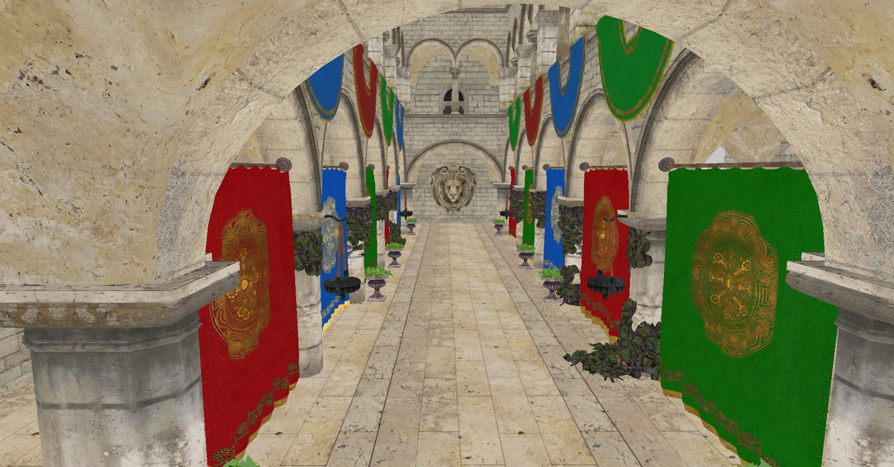

# FoxFuryRenderer
Vulkan Abstraction Layer (DX12 is planned in some remote future)

## Disclaimer
This project is still in early development, expect API changes, bugs and missing features.




Sponza rendered with draw indexed indirect using bindless array of textures 

## Overview
This hobby project is a static library for a thin Vulkan abstraction layer written in C++ (may become C in the future). It simplifies Vulkan API usage by providing a higher-level, more user-friendly (similar to OpenGL) interface for developers while maintaining the performance and flexibility of Vulkan. This abstraction layer serves as a helpful tool for those who want to work with Vulkan without dealing with its complex low-level details.

## Features
Simplified Vulkan: The abstraction layer hides much of the boilerplate code required when working directly with Vulkan, making it easier to create and manage resources.

Cross-Platform: The codebase is designed to be cross-platform, allowing you to use Vulkan on various operating systems without major code changes.

Performance: While abstracting Vulkan, the library ensures that performance is not sacrificed, providing a direct path to Vulkan's capabilities.

## Getting Started
To get started with this Vulkan abstraction layer, follow these steps:

Clone this repository to your local machine.

```
git clone https://gitlab.com/RedFoxStudio/furyrenderer.git
git submodule update --init --recursive
```

Build the Library by running CMake and then compiling the code.

Integrate with Your Project: Include the library in your C++ project and start using the Vulkan abstraction layer to simplify your Vulkan development.

Usage
Here's a simple example of how to create a Vulkan instance using the abstraction layer:

```
// Include the vulkan context factory
#include "backend/vulkan/VulkanContextFactory.h"

int main() {
        Fox::DContextConfig config;
        config.logOutputFunction = &LogMessages;
        config.warningFunction   = &LogMessages;

        Fox::IContext* context = Fox::CreateVulkanContext(&config);
    // Continue with Vulkan operations using the abstraction layer
    // ...

    return 0;
}
```

## Documentation
For detailed documentation, usage examples, and API reference, please refer to the examples provided in this repository.

## License
This project is licensed under the GNU GENERAL PUBLIC LICENSE. See the LICENSE file for details.

## Contributing
Contributions are welcome! If you would like to contribute to this project create a pull request!

## Third party libraries
Here's the list of the libraries included in the project:
 - [Volk](https://github.com/zeux/volk.git): Vulkan runtime loader
 - [VMA](https://github.com/GPUOpen-LibrariesAndSDKs/VulkanMemoryAllocator): Vulkan memory allocator
 - [TinyGLTF](https://github.com/syoyo/tinygltf.git): Mesh and material loading. (Examples only)
 - [GLFW](https://github.com/glfw/glfw.git): A multi-platform library for window and input.(Examples only)
 - [GLI](https://github.com/g-truc/gli.git): Image library(used to load the textures).(Examples only)
 - [GLM](https://github.com/g-truc/glm.git): Mathematics library for graphics software.(Examples only)
 - [STB](https://github.com/nothings/stb.git): Image loading/decoding.(Examples only)

